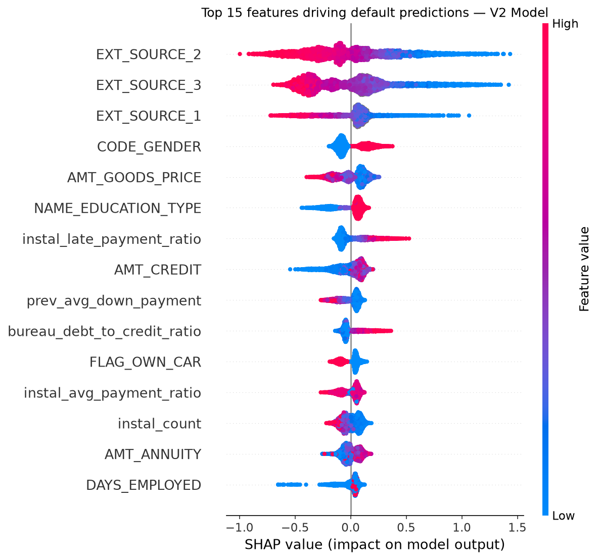

# Credit Risk Scoring for Thin-File Borrowers

A machine learning system that predicts loan default probability for 
borrowers with limited credit history, using behavioral and financial 
signals from 6 data sources.

**ROC-AUC: 0.7755 | Average Precision: 0.2724 | 307,511 applicants**

---

## Problem

Traditional credit scoring excludes millions of people with no credit 
history — first-time borrowers, young earners, migrants. Banks have no 
data to evaluate them, so they reject them outright.

This project builds a classifier that predicts repayment likelihood 
from *indirect* signals: income patterns, employment stability, 
historical payment behavior, and external credit scores — without 
requiring traditional credit history.

---

## Dataset

[Home Credit Default Risk](https://www.kaggle.com/competitions/home-credit-default-risk)
— 307,511 loan applications across 6 relational tables.

| Table | Rows | What it contains |
|---|---|---|
| application_train.csv | 307,511 | Applicant demographics and financials |
| bureau.csv | 1.7M | Previous loans from other banks |
| bureau_balance.csv | 27.2M | Monthly payment status of bureau loans |
| installments_payments.csv | 13.6M | Payment history on Home Credit loans |
| credit_card_balance.csv | 3.8M | Monthly credit card behavior |
| previous_application.csv | 1.6M | Previous Home Credit applications |

**Target:** `TARGET` — 0 = repaid, 1 = defaulted (8% default rate)

---

## Approach

### Feature Engineering
- Fixed `DAYS_EMPLOYED` anomaly (365,243 placeholder for unemployed)
- Engineered 5 domain features: income-to-annuity ratio, employment 
  stability index, debt burden ratio, application completeness score
- Aggregated all 5 supplementary tables into 33 behavioral features 
  per applicant (late payment ratios, bureau debt ratios, approval 
  history, credit utilization)

### Modeling
- Compared Logistic Regression, Random Forest, and LightGBM
- Used 5-fold stratified cross-validation throughout
- Benchmarked 3 class imbalance strategies: class weights, SMOTE, 
  threshold tuning
- SMOTE degraded performance due to feature space overlap — class 
  weights selected as optimal strategy

### Two-version improvement arc

| | V1 (static features) | V2 (+ behavioral) |
|---|---|---|
| Features | 77 | 111 |
| CV ROC-AUC | 0.7548 | 0.7717 |
| Test ROC-AUC | 0.7597 | 0.7755 |
| Average Precision | 0.2488 | 0.2724 |
| False positives (threshold 0.40) | 24,687 | 22,935 |

Adding behavioral features from supplementary tables reduced false 
positives by 1,752 — meaning 1,752 good customers wrongly rejected 
by V1 were correctly approved by V2.

---

## Key Findings

**SHAP Analysis — Top predictors of default:**



- EXT_SOURCE_2 and EXT_SOURCE_3 are the strongest predictors — 
  higher external credit scores strongly indicate repayment
- 5 of the top 15 features came from behavioral data engineered 
  from supplementary tables, confirming their value
- `instal_late_payment_ratio` (rank 7) — applicants with history 
  of late installment payments show significantly higher default risk
- `bureau_debt_to_credit_ratio` (rank 10) — high debt relative to 
  credit limit is a strong default signal

**Threshold Analysis:**

| Threshold | Defaulters caught | Good customers wrongly rejected | FP/TP ratio |
|---|---|---|---|
| 0.30 | 4,425 (89.1%) | 32,177 | 7.3 |
| 0.40 | 3,966 (79.9%) | 22,935 | 5.8 |
| 0.50 | 3,418 (68.8%) | 15,467 | 4.5 |

Recommended deployment threshold: **0.40** — balances recall with 
commercially viable false positive rate.

---

## Results

| Metric | Value |
|---|---|
| ROC-AUC | 0.7755 |
| Average Precision | 0.2724 |
| CV Std Deviation | 0.0020 |
| Recall at threshold 0.40 | 79.9% |

---

## Project Structure
credit-risk-scorer/
├── notebooks/
│   ├── 01_eda.ipynb                      # EDA and findings
│   ├── 02_feature_engineering.ipynb      # V1 feature engineering
│   ├── 03_modeling.ipynb                 # V1 modeling and comparison
│   ├── 03b_feature_engineering_v2.ipynb  # Behavioral feature aggregation
│   ├── 03c_modeling_v2.ipynb             # V2 modeling
│   └── 04_evaluation.ipynb               # Final evaluation and SHAP
├── models/
│   ├── champion_lightgbm_v2.pkl          # Trained V2 model
│   └── feature_names_v2.pkl              # Feature list for inference
├── reports/
│   ├── shap_summary_v2.png               # SHAP feature importance
│   ├── roc_curve_v2.png                  # ROC curve
│   ├── pr_curve_v2.png                   # Precision-recall curve
│   ├── confusion_matrix_v2.png           # Confusion matrix
│   └── model_card.md                     # Model card
├── app/
│   └── app.py                            # Streamlit web application
└── requirements.txt

---

## How to Run

```bash
# Clone the repo
git clone https://github.com/DARSHAN-V26/credit-risk-scorer.git
cd credit-risk-scorer

# Create and activate virtual environment
python3 -m venv env
source env/bin/activate

# Install dependencies
pip install -r requirements.txt

# Run the Streamlit app
streamlit run app/app.py
```

---

## Tech Stack

Python · LightGBM · scikit-learn · pandas · NumPy · SHAP · 
Streamlit · Matplotlib · Seaborn · joblib

---

## Author

**Darshan V**  
B.Tech Mechanical Engineering, IIT Hyderabad  
[LinkedIn](https://linkedin.com/in/darshan-v-7b666a323) · 
[GitHub](https://github.com/DARSHAN-V26)

